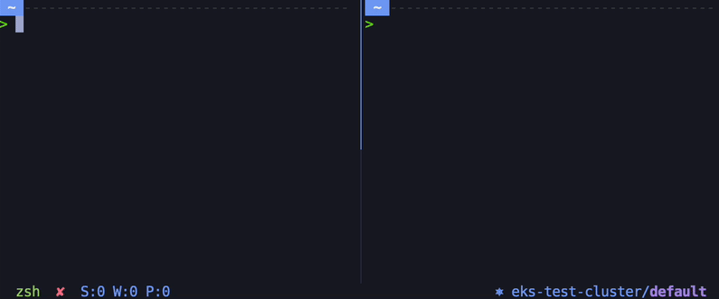

# kubie-tmux
Simple [kubie](https://github.com/sbstp/kubie) plugin for `tmux` that display pane's current kubernetes context and namespace when using `kubie`.

If `kubie` is not installed or no kubie shell is running it will use `kubectl` context.

# Motivation
There is already existing kubernetes contexts tmux plugins (eg. [kube-tmux](https://github.com/jonmosco/kube-tmux)) but not for `kubie` users.

Kubie spawns a subshell with a copy of the kubeconfig file meaning that you can have multiple kubernetes contexts per TTYs.

To get this specific information for each tmux pane, you need to get the environment variables from the pane's TTY  as `kubectl` command thru a tmux script will be running at the tmux session's level not in kubie's subshell.

As each tmux pane is in separate TTYs, we can have multiple kubernetes contexts per pane using kubie and display the information per pane.

# Requirements
- `kubectl`
- `yq`
- `kubie` *(not mandatory but that's the whole point of this plugin)*

# Usage
- Copy the `kubie.tmux` file where you usually store your tmux scripts (don't forget to `chmod +x kubie.tmux`)
- Add the script to your tmux status bar like so : \
  `set -g status-right "#(<PATH_TO_YOUR_TMUX_SCRIPTS>/kubie.tmux #{pane_pid})"`

Full usage in my tmux config file [here](https://github.com/eliasbokreta/dotfiles/blob/master/tmux.conf).
